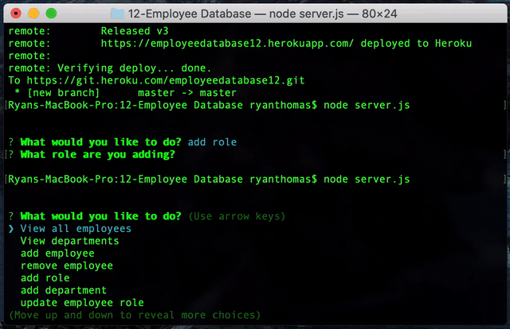

# Employee Database
Here is my database. I created it with JavaScript and tested/ran it in node.js. Multiple prompts ask you to view, delete, update, or add roles, employees, and departments. It functions off three different tables using mysql, inquirer, and npm.

##  Links
Git Hub Repository
https://github.com/rythomas2525/12employeedatabase

## GIF

## Developed by Ryan Thomas
